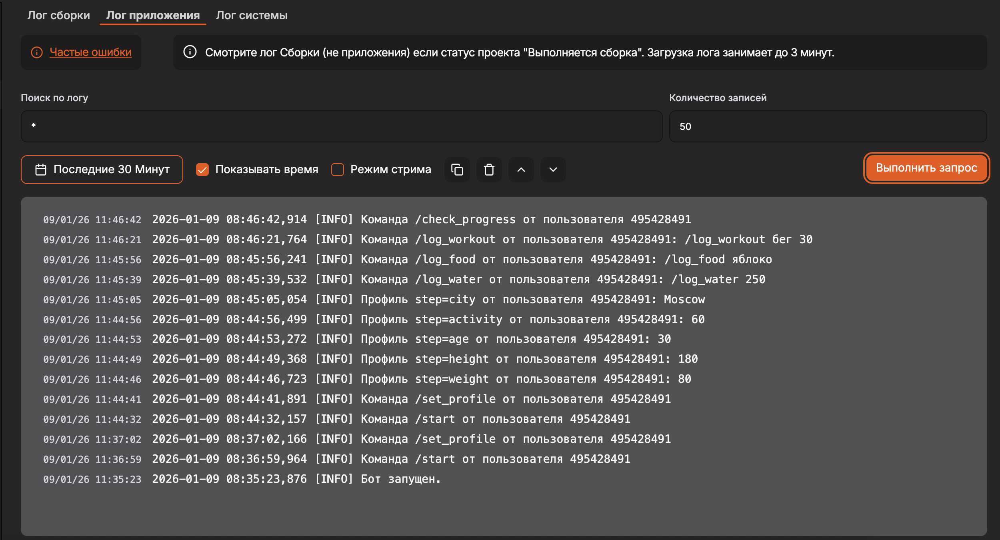
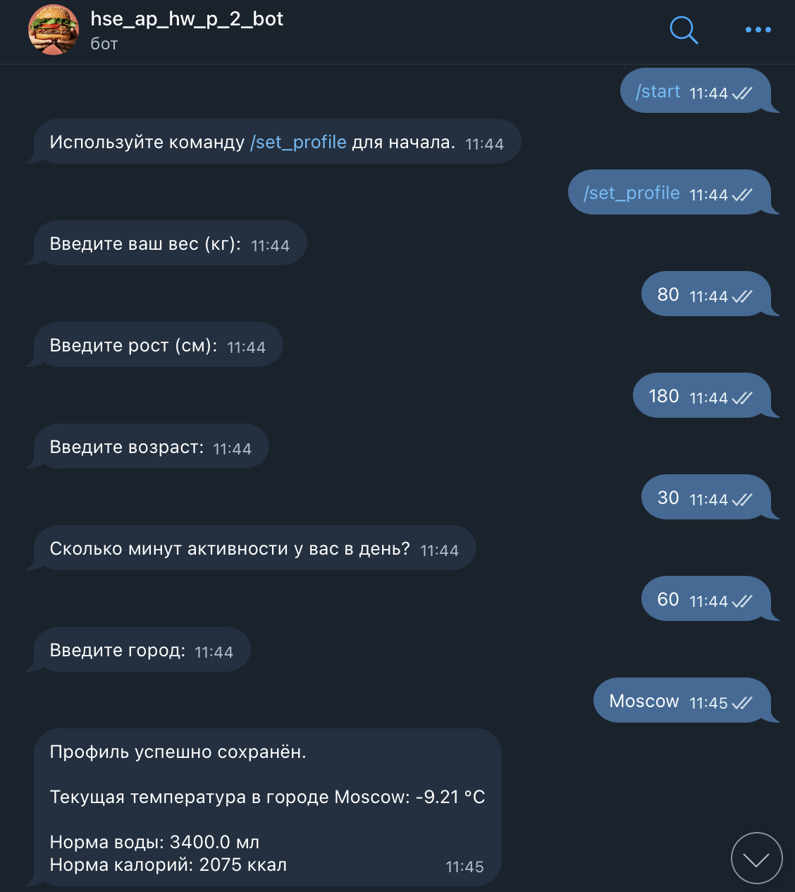
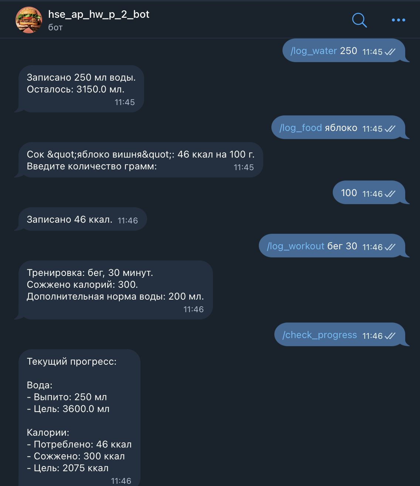

# Telegram Fitness Bot

Бот для отслеживания воды, калорий и тренировок с возможностью получения погоды через OpenWeather API.

## Локальный запуск

1. Клонируйте репозиторий:

```bash
git clone https://github.com/karanovon/hse_ap_hw_p_2.git
cd hse_ap_hw_p_2
```

2. Создайте виртуальное окружение и установите зависимости:

```bash
python -m venv venv
source venv/bin/activate  # Linux/Mac
venv\Scripts\activate     # Windows

pip install -r requirements.txt
```

3. Создайте файл .env с токенами:

```bash
TELEGRAM_TOKEN=<ваш_токен_бота>
OPENWEATHER_TOKEN=<ваш_токен_OpenWeather>
```

4. Запустите бота:

```bash
python bot.py
```

## Онлайн-деплой

Бот задеплоен на [Amvera](https://cloud.amvera.ru/) и работает онлайн. Просто отправьте команды боту `@hse_ap_hw_p_2_bot` в Telegram.

**Скрины логов:**



**Скрины запросов в тг:**



